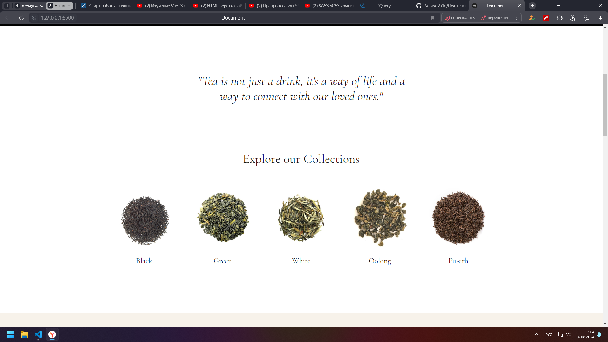

## Верстка одностраничного сайта по макету Figma с адаптивом
----
- Использовала простой HTML + CSS.
- JS использовала для создания выпадающего меню.
- Footer сделан на смеси гридов и флексов.
- Адаптив сделан на ширину экрана 1000px, 860px, 768px, 680px, 480px, 360px.
- В конце добавила иконку из favicon для вкладки страницы. Делала это впервые!
- CSS файлы поделила из одного большого на маленькие компоненты с целью структурирования.

[Ссылка на макет](https://drive.google.com/file/d/1MmhE-n05AVMBFBTX9xCi4WAykIBZFVN-/view) представлена тут.

